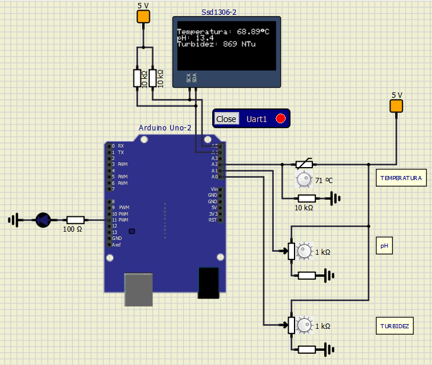
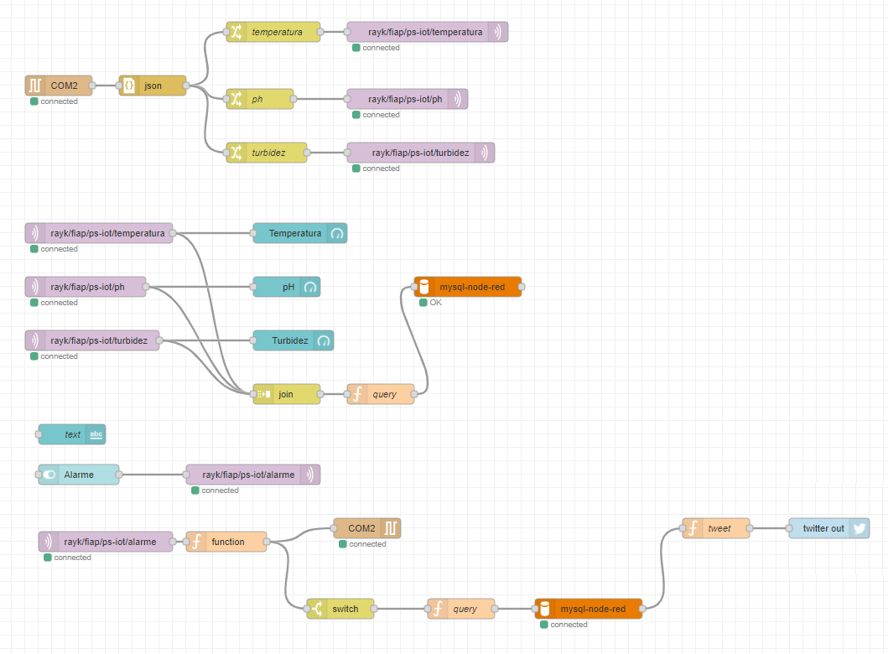
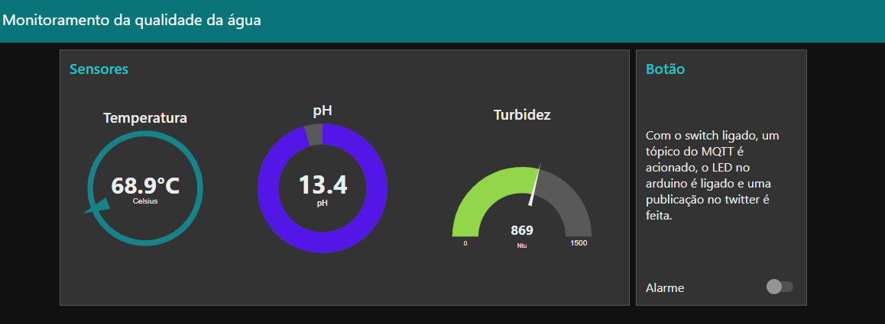

## CASE MONITORAMENTO IOT
SISTEMA DE MONITORAMENTO DE DESPOLUIÇÃO DO RIO PINHEIROS

**Integrantes:** <br>
> [**Jefrey Marcus Machado**](https://www.linkedin.com/in/jefreymarcus/) **- RM81694**<br>
> [**Jonatas Martins De Castro**](https://www.linkedin.com/in/jonatas-martins-de-castro-bb9397106/) **- RM81510**<br>
> **Lucas Lima Teixeira - RM81541**<br>
> [**Marcos Farias**](https://www.linkedin.com/in/fmarcoos/) **- RM81731**<br>
> [**Rayk Rocha**](https://www.linkedin.com/in/rayk/) **- RM81723**<br>


**Turma:** 4SIA

**Ano:** 2021

## Objetivo

Desenvolver uma solução IoT de monitoramento da qualidade da água baseada minimamente em Arduino e node-red.<br>
Consiste em posicionar sensores em locais estratégicos para coletar informações de pH, temperatura e turbidez da água a cada 30 segundos e enviar tópicos via protocolo MQTT. O sistema no Node-red irá subscrever os tópicos e irá salvar os dados no MySQL e exibir as informações em um dashboard. Um tópico MQTT é acionado ao ligar o switch do dashboard, ligando o led no arduino e publicando no twitter que ele foi acionando, assim como, com os ultimos dados da coleta.

## Diagrama do projeto
**Circuito eletrônico**



**Fluxo Node-Red**



**Dashboard Node-Red UI**




## Como usar 

0. **Para rodar o projeto, será necessário ter os softwares:**

    - [SimulIDE](https://www.simulide.com/p/home.html)
    - [Arduino](https://www.arduino.cc)
    - [com0com](http://com0com.sourceforge.net)
    - [Node-RED](https://nodered.org)

1. **Configurando o Com0com**
    - <a href="https://www.youtube.com/watch?v=I6YIPL_p-L0" target="_blank">Tutorial</a>


2. **Clone o repositório em sua máquina**

    ```
    git clone https://github.com/RaykRocha/ps-IoT.git
    ```
3. **SimulIDE**

    No SimulIDE importe os arquivos .simu e .ino, compilar, fazer o upload e ativar o circuito.

4. **Node-RED**
    
     Para iniciar o Node-RED, digite:
    ```
   node-red
    ```
    
    Acesse:
    
    ```
    https://127.0.0.1:1880
    ```
    
    Instale os modules
    * node-red-dashboard
    * node-red-node-serialport
    * node-red-node-twitter
    * node-red-node-mysql

    Dashboard:
    
    ```
    https://127.0.0.1:1880/ui
    ```

    Importe o flow para o Node-RED e faça Deploy!

## Vídeo demonstração

[Yotube](https://youtu.be/ANQoIaplHD8)
